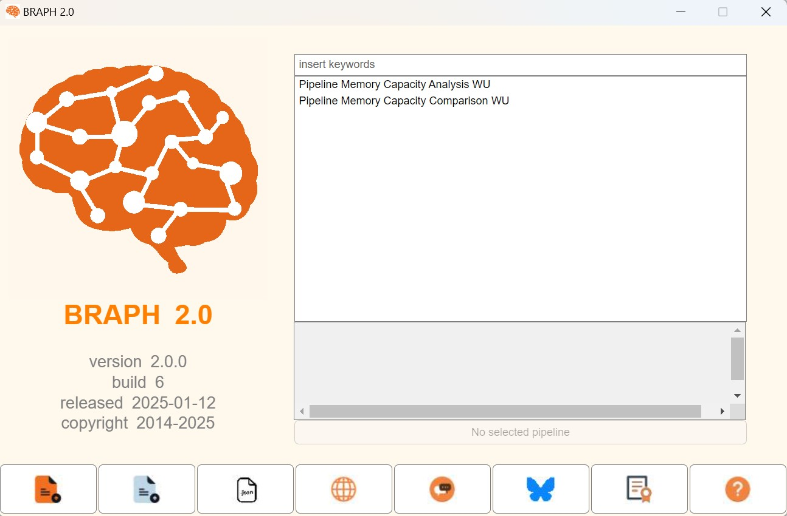
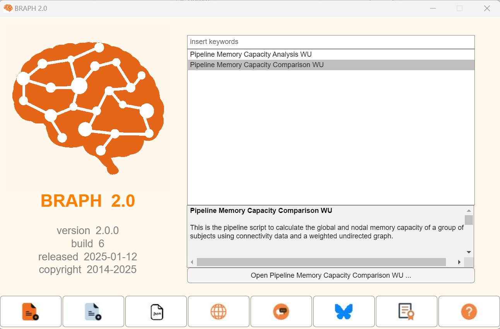
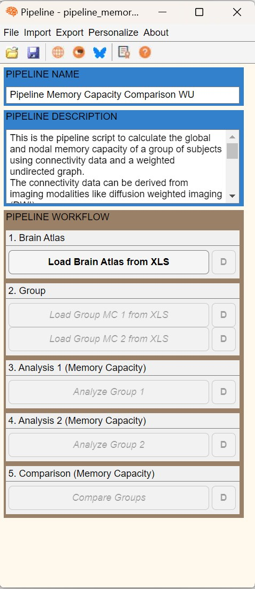
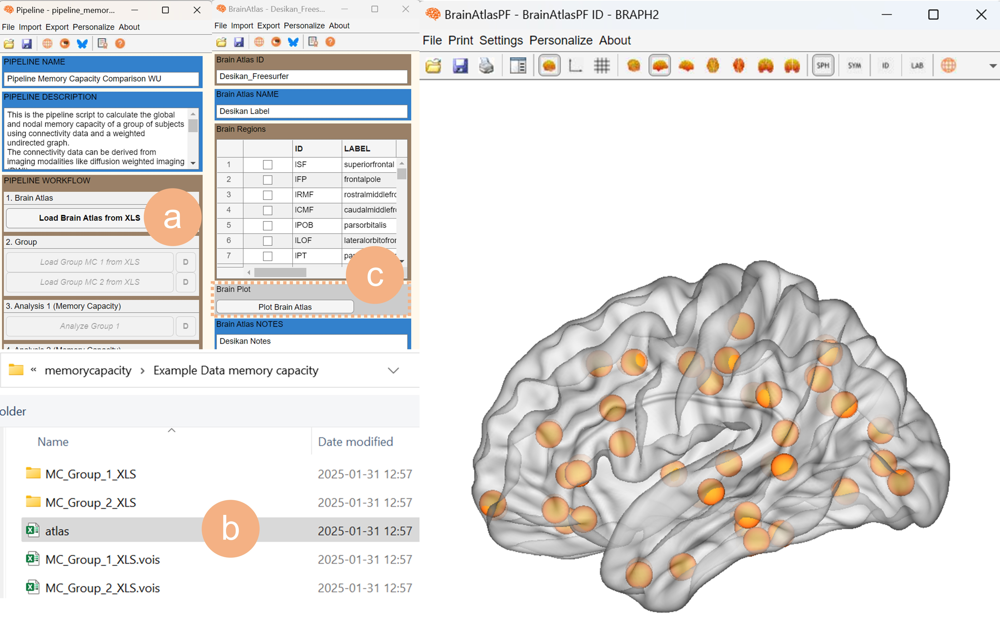
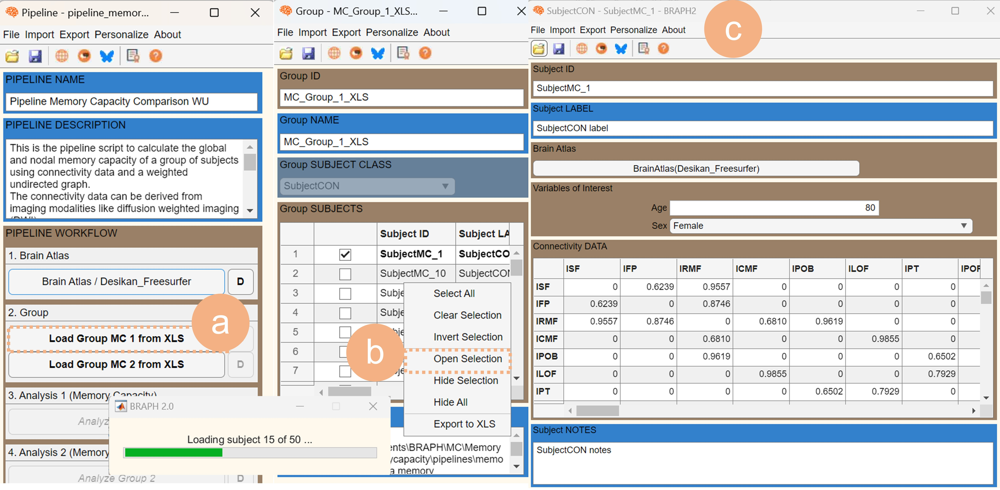
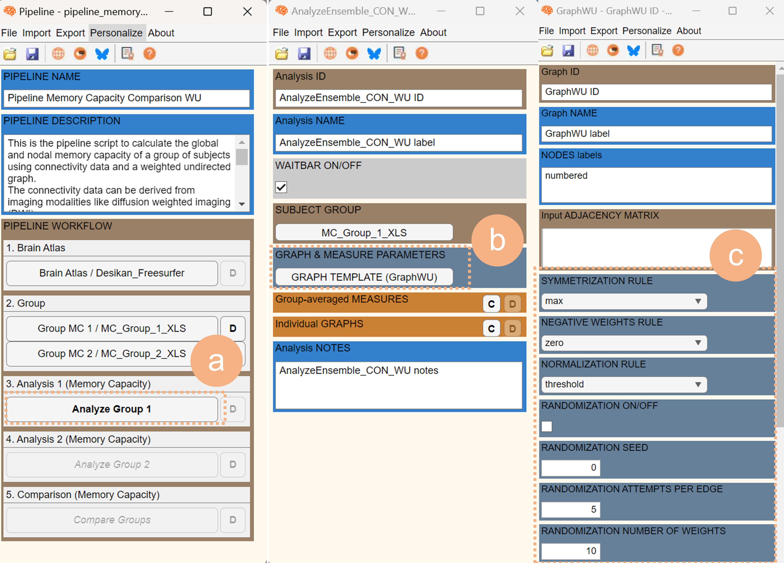
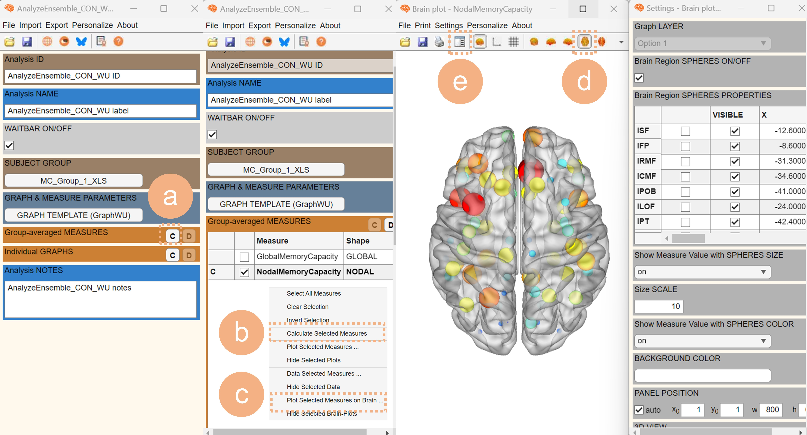
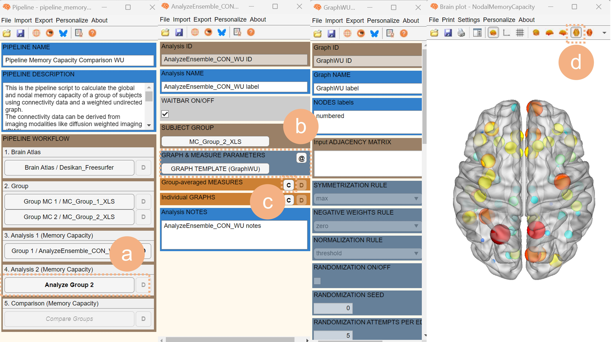
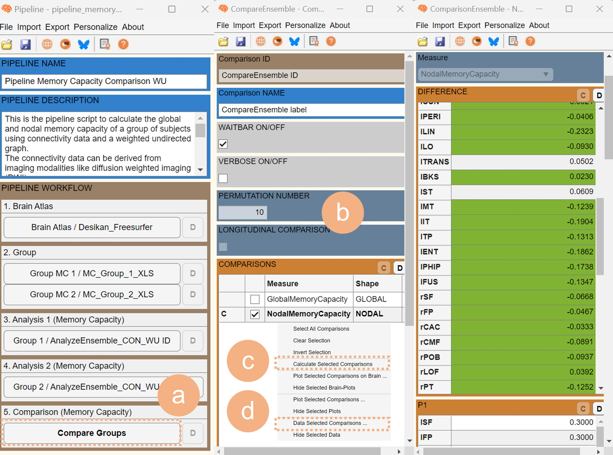
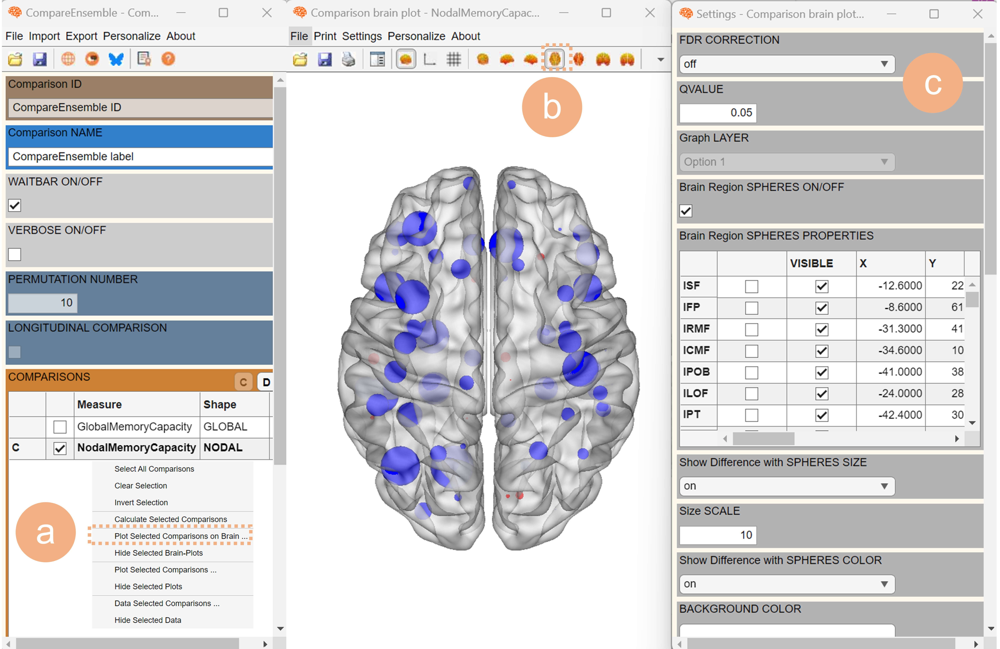

# Pipeline for Analysis and Comparison of Memory Capacity using Weighted Undirected Graph

[](tut_mc_wu.pdf)

This tutorial shows how to perform a *reservoir computing* analysis using *connectivity data* (see tutorial [Group of Subjects with Connectivity Data](https://github.com/braph-software/BRAPH-2/tree/develop/tutorials/data/tut_gr_con)), where one connectivity matrix per subject is available, as in diffusion weighted imaging or pre-calculated matrices obtained from functional MRI, MEG, or EEG. Step by step, this pipeline guides you to first analyze the data of a group of subjects and then compare the data from two groups of subjects, were matrices are *weighted undirected*.  With this tutorial, you will be able to extract and plot differences between two groups. You will also be able to generate publication-quality figures.


## Table of Contents
> [Generate Example Data](#Generate-Example-Data)
>
> [Open the GUI](#Open-the-GUI)
>
> [Step 1: Load the Brain Atlas](#Step-1-Load-the-Brain-Atlas)
>
> [Step 2: Load the Connectivity Group Data](#Step-2-Load-the-Connectivity-Group-Data)
>
> [Step 3: Analyzing the Data of Group 1](#Step-3-Analyzing-the-Data-of-Group-1)
>
>> [Setting Analysis Parameters](#Setting-Analysis-Parameters)
>>
>> [Calculate Measures](#Calculate-Measures)
>>
> [Step 4: Analyzing the Data of Group 2](#Step-4-Analyzing-the-Data-of-Group-2)
>
> [Step 5: Comparing Groups](#Step-5-Comparing-Groups)
>


<a id="Generate-Example-Data"></a>
## Generate Example Data  [⬆](#Table-of-Contents)

You can generate the example data by typing in the command line the instruction in Code 1.


> **Code 1.** **Command to generate example data.**
> 		Command to generate the example data for connectivity analyses. This script will create two groups of subjects and the associated atlas files. Each subject has a weighted random connectivity matrix with a mean nodal degree of 4, which has been derived using the Watts–Strogatz model (group 1 uses a rewiring probability of 0.3 and group 2 has a rewiring probability of 0.85). After running the code, the data will be created in ".braph2memorycapacity/pipelines/memorycapacity/Example Data memory capacity", and includes the brain atlas "atlas.xlsx", two folders with the subject files "MC_Group_1_XLS" and "MC_Group_2_XLS", and the associated covariates files "MC_Group_1_XLS.vois.xlsx" and "MC_Group_2_XLS.vois.xlsx". The details about the format of these files can be found in the tutorials [Brain Atlas](https://github.com/braph-software/BRAPH-2/tree/develop/tutorials/data/tut_ba) and [Group of Subjects with Connectivity Data](https://github.com/braph-software/BRAPH-2/tree/develop/tutorials/data/tut_gr_con).
> ````matlab
> create_data_memorycapacity()
> ````
> 

<a id="Open-the-GUI"></a>
## Open the GUI  [⬆](#Table-of-Contents)

The GUI of BRAPH 2 Memory Capacity Distribution can be opened by typing `braph2` in MatLab's terminal. This GUI allows you to select a pipeline, as shown in Figure 1.



> **Figure 1. BRAPH 2 Memory Capacity Distribution main GUI**
> BRAPH 2 main GUI with the two pipelines for this distribution: *Pipeline Memory Capacity Analysis WU* and *Pipeline Memory Capacity Comparison WU*.

In this tutorial it will be explained *Pipeline Memory Capacity Comparison WU* since it also covers *Pipeline Memory Capacity Analysis WU* (Step 3 and Step 4 of the tutorial). First, we select the pipeline that we want to run. Once a it is selected a short description of the pipeline will be displayed, as shown in Figure 2. Then we press the "Open Pipeline Memory Capacity Comparison WU" button.



> **Figure 2. Pipeline Memory Capacity Comparison WU**
> Selected *Pipeline Memory Capacity Comparison WU* with short description.


Once the pipeline is uploaded, you can see a GUI that contains different steps to: upload a brain atlas, upload the connectivity data of two groups, analyze them, and finally, compare the groups (Figure 3). 



> **Figure 3. Pipeline steps**
> These are the steps of the pipeline. Only the first step is active when the pipeline is first opened. Subsequent steps will become active sequentially.


<a id="Step-1-Load-the-Brain-Atlas"></a>
## Step 1: Load the Brain Atlas  [⬆](#Table-of-Contents)


Figure 4 shows how to upload and plot the brain atlas that you used to extract the data for your analysis. For more information on where to find different atlases or how to change plotting settings on the brain surface, check the tutorial [Brain Atlas](https://github.com/braph-software/BRAPH-2/tree/develop/tutorials/data/tut_ba).



> **Figure 4. Uploading the Brain Atlas**
> Steps to upload the brain atlas:
> 	**a** Click on "Load Atlas" from the pipeline GUI.
> 	**b** Navigate to the BRAPH 2 folder "atlases" or the *Example Data memory capacity folder* and select one of the atlas files, in this example the "atlas.xlsx". 
> 	**c** You can visualize the brain atlas by pressing "Plot Brain Atlas".


<a id="Step-2-Load-the-Connectivity-Group-Data"></a>
## Step 2: Load the Connectivity Group Data  [⬆](#Table-of-Contents)

After you have loaded the brain atlas, you can upload the *Group MC data* for each group as shown in Figure 5. A new interface will be shown containing the data for the group you just selected. You can open each subject’s connectivity matrices by selecting the subject, right click, and select “Open selection” (for more information check the tutorial [Group of Subjects with Connectivity Data](https://github.com/braph-software/BRAPH-2/tree/develop/tutorials/data/tut_gr_con)).



> **Figure 5. Loading and visualizing the group data**
> **a** From the pipeline GUI, click on "Load Group MC 1 from XLS" to load the data of group 1.
> 	**b** Once the data is uploaded, you can select a subject, right click and select `Open selection`.
> 	**c** This will open the connectivity matrix of the subject in addition to the age and sex of that subject (which are the variables of interest available for the example data).
> 	You can then repeat the same procedure for group 2.


<a id="Step-3-Analyzing-the-Data-of-Group-1"></a>
## Step 3: Analyzing the Data of Group 1  [⬆](#Table-of-Contents)

Once you have loaded the data for both groups, you can begin analyzing the data for the first group by clicking on "Analyze Group 1" (Figure 6a). 
This will open a new interface called "Analyze Ensemble", which allows you to calculate and visualize graph measures for the first group. 
Before these network measures are calculated, it is important to ensure that the graph and measure parameters are set correctly.

Importantly, the parameters you select at the beginning will remain fixed for the rest of pipeline to ensure the consistency of the analysis (including the analysis of the second group and the comparison between groups). We will now guide you through the process of preparing these parameters for both measures and graphs. It is important to keep in mind that the default parameters should work well for most cases.

<a id="Setting-Analysis-Parameters"></a>
### Setting Analysis Parameters  [⬆](#Table-of-Contents)

In the "Analyze Ensemble" interface (Figure 6), you can configure the analysis parameters.
In the `GRAPH & MEASURE PARAMETERS` section, you can define the following parameters:


	
	- `SYMMETRIZATION RULE` determines how to symmetrize the matrix. There are four options: `max sum average min`.
	
	- `NEGATIVE EDGE RULE` determines how to remove the negative edges. There are two options: `zero absolute`.
	
	- `NORMALIZATION RULE` determines how to normalize the weights between 0 and 1.There are two options `threshold range`,
	
	- `RANDOMIZE ON/OFF` determines whether to randomize the graph. *Typically does not need to be changed.*
	
	- `RANDOM SEED` is the randomization seed. *Typically does not need to be changed.*
	
	- `RANDOMIZATION ATTEMPTS PER EDGE` is the attempts to rewire each edge. *Typically does not need to be changed.*
	
	- `RANDOMIZATION NUMBER OF WEIGHTS` specifies the number of weights sorted at the same time. *Typically does not need to be changed.*
	




> **Figure 6. Configuring analysis parameters**
> **a** By clicking on the section `GRAPH & MEASURE PARAMETERS`, you open **b** a new interface that permits you to configure the graph parameters. **c** The available parameters shall be set at this point.


<a id="Calculate-Measures"></a>
### Calculate Measures  [⬆](#Table-of-Contents)
After configuring the parameters, you can proceed to calculate specific graph measures (Figure 7). To do this, scroll down to locate the "Group-averaged MEASURES" panel. By clicking the `C` button, you will see a table displaying all measures. The following two measures are available for this pipeline:


	
	- `Global Memory Capacity`: The global memory capacity measures how well a network manages to encode a random input signal in its reservoir (Jaeger, 2001).This global memory capacity is determined by training the network output to reproduce delayed input time series and comparing the delayed input with the reservoir output across all reservoir nodes. A high memory capacity indicates that the network has high capacity to remember and process the temporal information contained in the input signal. The measure is calculated using reservoir computing, which is a recurrent neural-network model.
	
	- `Nodal Memory Capacity`:	The nodal memory capacity measures how well a given node manages to encode a random input signal applied to itself.This nodal memory capacity is determined by training the nodal output to reproduce delayed input time series  and comparing the delayed input applied to the given node with its output.  A high memory capacity indicates that the node has high capacity to remember and process the temporal  information contained in the input signal. The measure is calculated using reservoir computing, which is a recurrent neural-network model.
	


 More details about the calculation of these two measures can be found at: Mijalkov et al. Computational memory capacity predicts aging and cognitive decline. (2024).



> **Figure 7. Analyzing the Group Data**
> **a** Locate the `Group-averaged MEASURES` panel and click the `C` button to see all available measures. 
> 	**b** Choose the `NodalMemoryCapacity` measure, right-click it, and select `Calculate Selected Measures` to perform the calculation.
> 	**c** To visualize the results, right-click on the top of the table and choose `Plot Selected Measures on Brain` in the Analyze Ensemble interface. This action opens a brain surface with the `NodalMemoryCapacity` plotted.
> 	**d** Explore different views such as the `Axial dorsal` button in the brain surface toolbar.
> 	**e** Customize and save plot visualizations within the settings menu.


As an example, let us select the `NodalMemoryCapacity` measure. Right-click at the top of the table and choose `Calculate Selected Measures`. Once the calculation is complete, you will notice a `C` appearing in front of the `NodalMemoryCapacity` row, indicating that this measure has been calculated.

If you wish to visualize the results, right-click on the top of the table and select `Plot Selected Measures on Brain` within the Analyze Ensemble interface (Figure 7). This will open a brain surface with the "NodalMemoryCapacity" plotted on it.

Within the toolbar of the brain surface interface, you can explore various views.
For instance, by clicking on the `Axial dorsal` button (Figure 7c), you will get the same view as shown in Figure 7d. Additionally, clicking on the `Settings Panel Figure` button (Figure 7e) in the same toolbar allows you to adjust different visualization settings.

For instance, within the settings menu (Figure 7e), you can disable the size effect. Within the settings menu, you can customize the visualization of the plots and save them for reference.

Finally, when you right-click in the `Group-averaged MEASURES` panel, you will find other options to explore, such as `Plot Selected Measures` (which generates a line plot for the selected measure at different thresholds and/or different nodes) and `Data Selected Measure` (providing the calculated values of the selected measures). These options can also be saved for further analyses outside BRAPH 2.


<a id="Step-4-Analyzing-the-Data-of-Group-2"></a>
## Step 4: Analyzing the Data of Group 2  [⬆](#Table-of-Contents)

After completing the analysis of the first group, you can analyze the second group by simply clicking on `Analyze Group 2` (Figure 8a). You will notice that in the new GUI (Figure 8b-c), the parameters you previously selected for the first group are already preselected and fixed for this analysis. 



> **Figure 8. Parameters blocked in the Analysis of Group 2**
> **a** Click on "Analysis Group 2" in the pipeline's GUI.
> 	**b** In this new window, you can see that the measure parameters, when clicking **b** "GRAPH TEMPLATE", such as  **c** "SYMMETRIZATION RULE",  "NEGATIVE WEIGHTS RULE", "NORMALIZATION RULE" and "RANDOMIZATION" settings are blocked since they should be the same as the ones set in the analysis of group 1. You can reset the analysis parameters for Group 1 by clicking on the checkbox marked with a `D` next to the settings of Group 1.


<a id="Step-5-Comparing-Groups"></a>
## Step 5: Comparing Groups  [⬆](#Table-of-Contents)

After exploring the memory capacity measures for each group, you can proceed to their statistical comparison by clicking on `Compare Groups` (Figure 9a).



> **Figure 9. Compare the groups**
> **a** Click on `Compare Groups` in the pipeline's GUI. A new window will pop up, where you can select to turn ON/OFF the wait bar and verbose functions, you can change the number of permutations, and whether to perform a longitudinal group comparison. We set the number of permutations to 10 for this tutorial **b**. Finally, you can calculate the comparisons of some graph measures between groups **c**.


In the new window, you have several options to configure the analysis. First, you can choose whether to enable a progress bar and verbose functions while the analysis is running, which can help you monitor the progress of the analysis. You can also specify how many permutations you want to use to assess differences between groups (Figure 9b). For computational efficiency, in this tutorial we have set the number of permutations to 10. However, for your research analysis, we recommend using a higher number, such as 1000 or 10000 permutations, to ensure the results are robust.

If your groups are not independent and represent the same subjects assessed in different points in time, you can select the longitudinal comparison option. This option will permute the values within each subject, considering their temporal relationship.

Next, you can select the specific graph measures you wish to compare between the groups. To do this, click on `C` in the `COMPARISONS` section. Once you have chosen all the measures of interest, right-click and select `Calculate Selected Comparisons` (Figure 9c).

If you have enabled the progress bar and verbose functions, two additional windows will appear to display the progress of the comparison calculations. Finally, there is an option in this GUI to save intermediate results during the permutations, which can be helpful for further analysis.

To obtain the results from the comparisons, select the measures in the `COMPARISONS` panel and press `Data Selected Comparisons` ({Figure 9d}), and a new window will open where we can check the value of the difference between groups, the p-values (1-tailed and 2-tailed), as well as the confidence intervals.



> **Figure 10. Visualize the group comparison results on a brain surface**
> **a** Click on "Plot Selected Comparisons on Brain" in the Comparisons panel. 
> 	**b** In this new window, you will see the comparison results, with positive values in red and negative values in blue on the brain surface.
> 	**c** You can customize this visualization using the settings menu.


If you wish to visualize the results, right-click at the top of the table and select `Brain Graph Selected Comparison` within the Compare Ensemble interface (Figure 10a). This action will open a brain surface displaying the difference between these two groups in terms of the "NodalMemoryCapacity" data or any other nodal measure you have calculated.

Within the brain surface interface's toolbar, you have various options to explore. For example, by clicking on the “Axial dorsal” button (Figure 10b), you can access the same view depicted in previous figures during group analysis. Additionally, the “Settings Panel Figure” button in the same toolbar allows you to fine-tune different visualization settings.

For further customization, within the settings menu (Figure 10c), you can activate the `FDR CORRECTION` feature to control for multiple comparisons and reduce the chance of false positive results when assessing the significance of connectivity measures across multiple brain regions. You can also use the settings menu to personalize the visualization of your plots and save them.
